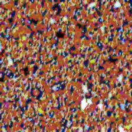
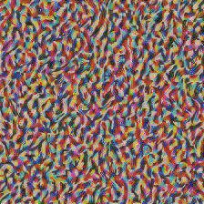
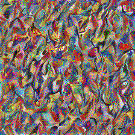
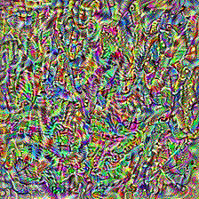
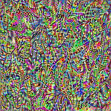
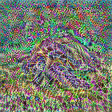

# Style Transfer in tfjs

This repository tries to implement the neural style transfer.

## Setup

To setup the repo run:

`npm run setup`

This will clone the required model into the directory.

## Run

To run the style transfer call:

`npm start`

## Extracted feature samples

Here are some samples of extracted features from style (first 5) and content (last one) from different layers.

